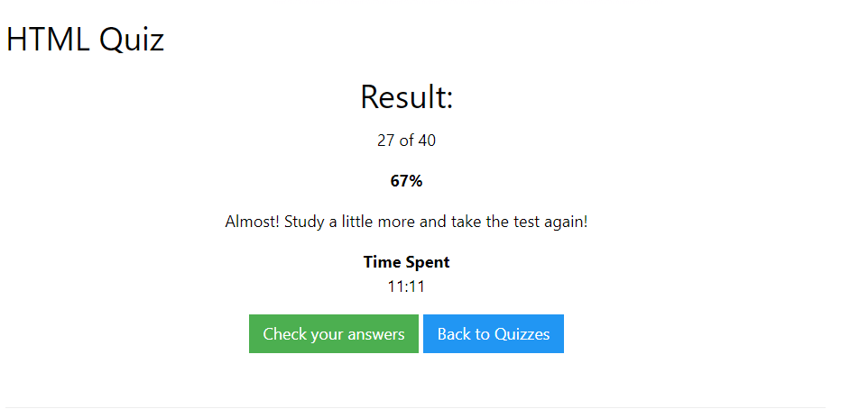

## HTML##
Siglas en inglés de HyperText Markup Language, hace referencia al lenguaje de marcado para la elaboración de páginas web.

[Ir a Quiz HTML](https://www.w3schools.com/html/html_quiz.asp)

## RESULTADOS DEL QUIZ##
