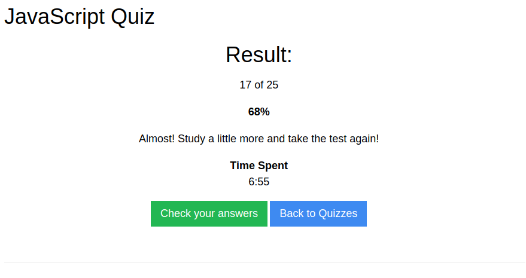

## JAVASCRIPT##
JavaScript es un lenguaje de programación interpretado, dialecto del estándar ECMAScript. Se define como orientado a objetos, basado en prototipos, imperativo, débilmente tipado y dinámico.

[Ir a Quiz JS](https://www.w3schools.com/js/js_quiz.asp)

## RESULTADOS DEL QUIZ##
