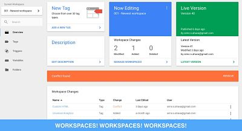
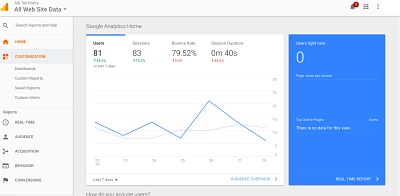

Es una herramienta para poder monitorear el trafico de tus paginas webs.

Lo primero que se debe hacer es crear una cuenta en **Tag Manager** y **Google Analytics**, guardar las etiquetas que te dan en el primero y el ID que te dan al registrarte en analytics.

En [Tag Manager](https://tagmanager.google.com/) hay que crear una nueva etiqueta y seleccionar [Google Analytics](https://analytics.google.com/analytics/web/), en la configuración de este se debe pegar el ID guardado anteriormente y le dan a guardar.

En la parte de activación solo debe seleccionar **«all pages»** y luego guardar todo.

 